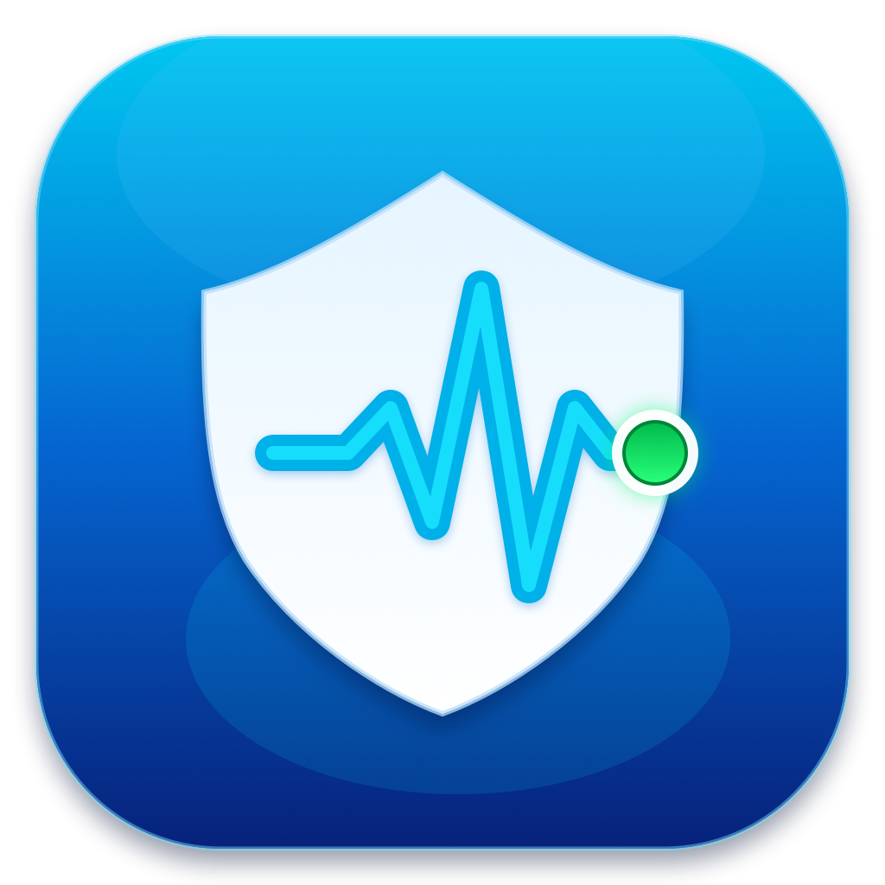
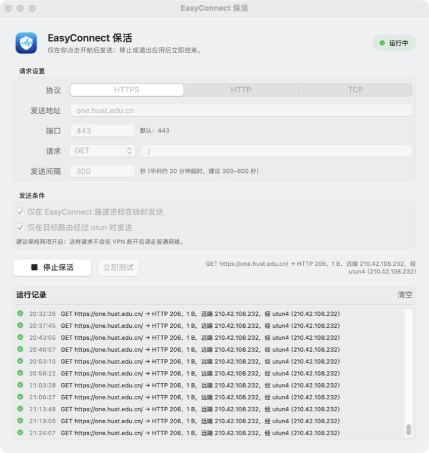

<div align="center">
  
  <h1>EasyConnect 保活</h1>
  <p>一个按需运行、可检查 VPN 路由的原生 macOS 保活工具。</p>
</div>

<p align="center">
  <a href="https://github.com/whyluna/EasyConnectKeepAlive/releases"></a>
  <a href="https://github.com/whyluna/EasyConnectKeepAlive/actions/workflows/build.yml"></a>
  <a href="LICENSE"></a>
  
</p>



## 为什么做这个工具

部分 EasyConnect/SSL VPN 服务端会在一段时间没有检测到有效内网访问后注销会话。即使 EasyConnect 主窗口仍然存在，SSH、远程开发或长时间实验也可能因此中断。

本工具在你点击“开始保活”后，按设定间隔向你指定的目标发送一个小请求。它可以同时检查 EasyConnect 隧道进程和目标路由，避免请求在 VPN 断开后误走普通网络。

> 本项目不是 EasyConnect 的破解、自动登录或重连工具，不保存账号密码，也不会绕过短信认证/MFA。

## 功能

- 原生 SwiftUI macOS 应用，退出应用后不再发起新请求。
- 支持 HTTPS、HTTP 和 TCP。
- HTTPS/HTTP 支持 GET、HEAD 和自定义路径。
- TCP 支持仅连接探测，或发送一段自定义文本。
- 可配置目标地址、端口和 30-3600 秒发送间隔。
- 可要求标准 EasyConnect 隧道进程处于在线状态。
- 可要求目标路由的出口网卡名称以 `utun` 开头。
- 提供“立即测试”、开始、停止和最多 200 条运行日志。
- HTTP GET 默认发送 `Range: bytes=0-0`；服务器支持时只下载 1 字节。
- HTTP 请求显式绕过系统/环境代理，避免误走 Clash 等本地代理。
- 不注册 LaunchAgent，不开机自启，不收集遥测。

## 下载与安装

1. 前往 [Releases](https://github.com/whyluna/EasyConnectKeepAlive/releases) 下载最新的 `EasyConnect-KeepAlive-*-macOS-universal.zip`。
2. 解压后，将“EasyConnect 保活.app”拖入“应用程序”文件夹。
3. 当前 Release 使用本地临时签名，未经过 Apple Developer ID 公证。首次打开若 macOS 提示无法验证开发者，请在 Finder 中右键应用并选择“打开”，再确认一次。

系统要求：macOS 14 或更高版本。Release 同时支持 Apple Silicon 和 Intel Mac。

## 使用方式

1. 正常登录 EasyConnect，确认 VPN 已连接。
2. 打开“EasyConnect 保活”。
3. 选择协议并填写目标。
   - 目标应是你有权访问、且确实需要经过该 VPN 的地址。
   - 默认 `https://one.hust.edu.cn/` 只是华中科技大学用户的示例；其他学校或单位请替换成自己的 VPN 内部目标。
4. 保持以下两个安全条件开启：
   - “仅在 EasyConnect 隧道进程在线时发送”
   - “仅在目标路由经过 utun 时发送”
5. 点击“立即测试”。建议确认日志同时显示：
   - HTTP 2xx/3xx 或 TCP 成功；
   - 路由经过 `utun*`；
   - 返回的远端地址符合预期。
6. 点击“开始保活”。运行期间配置会锁定。
7. 不再需要时点击“停止保活”，或直接退出应用。

如果服务端空闲超时约为 20 分钟，建议将间隔设置为 300-600 秒。不要把间隔设置得过于频繁。

## 协议说明

| 协议 | 请求方式 | 适用场景 |
| --- | --- | --- |
| HTTPS | GET / HEAD | 推荐。可访问 VPN 内部 HTTPS 页面时使用 |
| HTTP | GET / HEAD | 仅用于明确允许明文 HTTP 的内部目标 |
| TCP | Connect / 可选文本 | 只需要建立 TCP 连接，或目标要求简单探测文本时使用 |

## 安全与隐私

- 不读取或保存 EasyConnect 用户名、密码、Cookie、短信验证码或 Token。
- 不修改系统路由、DNS、VPN 配置或 EasyConnect 文件。
- 不会在登录窗口中代替用户操作，也不能恢复已经被服务端注销的会话。
- HTTP/HTTPS 请求使用 macOS 自带 `/usr/bin/curl`，设置 5 秒连接超时和 10 秒总超时。
- TCP 使用 macOS 自带 `/usr/bin/nc`，设置 5 秒连接/空闲超时。
- 点击停止后不会再发起新的周期请求；已经发出的单次请求可能在超时前完成。
- 自定义 TCP 内容会按设定周期重复发送，请只对你有权访问的目标使用。

## 已知限制

- 仅检测 EasyConnect 标准安装路径中的 `CSClient` 进程：`/Applications/EasyConnect.app/.../CSClient`。
- `utun` 只能证明请求走了 macOS 隧道接口，不能单独证明它属于哪一个 VPN 产品。
- 不同服务端对“有效活动”的定义可能不同。单次测试成功不等于服务端一定会重置空闲计时。
- 应用必须保持运行；它不会安装后台守护进程。

## 从源码构建

要求：macOS、Xcode Command Line Tools，以及可用的 macOS SDK。当前版本在 Xcode 26.6 上验证。

```bash
git clone https://github.com/whyluna/EasyConnectKeepAlive.git
cd EasyConnectKeepAlive
./scripts/build.sh
```

构建脚本会：

1. 使用原生绘制脚本生成 1024px 图标和完整 `.icns`；
2. 分别编译 arm64 与 x86_64；
3. 使用 `lipo` 合并通用二进制；
4. 生成本地临时签名的 `build/EasyConnect 保活.app`。

也可以运行 Swift Package 的常规检查：

```bash
swift build
```

## 项目结构

```text
Sources/                    SwiftUI 界面、控制器和探测逻辑
Resources/                  Info.plist 与主图标
scripts/build.sh            通用应用构建和签名
scripts/render_icon.swift   原生图标绘制
docs/                       README 截图
```

## 参与贡献

欢迎提交 Issue 和 Pull Request。涉及新的探测方式时，请说明：发送了什么数据、请求频率、超时行为，以及如何避免误走非 VPN 网络。

## 免责声明

本项目与深信服科技、EasyConnect 产品及任何学校或机构均无隶属、授权或背书关系。EasyConnect 及相关名称可能是其权利人的商标。本工具仅用于用户有权访问的网络与资源；使用者应遵守所在组织的网络和信息安全规定。

## License

[MIT](LICENSE)
